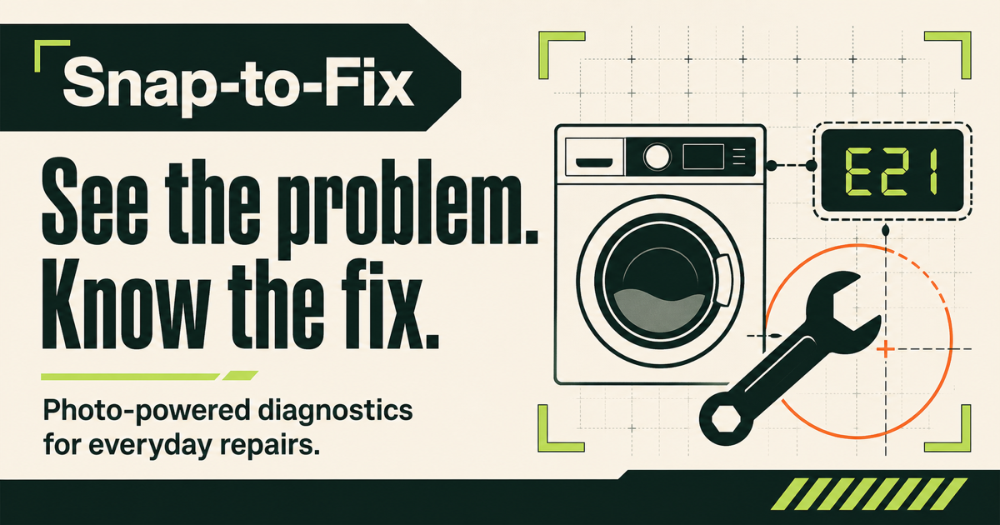

# Snap-to-Fix

**See the problem. Know the fix.**

Snap-to-Fix is a safety-first diagnostic assistant concept for everyday hardware problems. It is designed to help people understand appliance error codes, vehicle warning lights, and visibly damaged parts without searching through confusing manuals.

[](https://github.com/samu998676/snap-to-fix/actions/workflows/deploy-pages.yml)



## Try it

- **Live website:** [samu998676.github.io/snap-to-fix](https://samu998676.github.io/snap-to-fix/)
- **48-second walkthrough:** [Watch the product demo](https://samu998676.github.io/snap-to-fix/#watch-demo)
- **Standalone player:** [Open the dedicated video page](https://samu998676.github.io/snap-to-fix/demo.html)
- **Downloadable video:** [Download the 1080p MP4](https://samu998676.github.io/snap-to-fix/snap-to-fix-demo.mp4?v=2)

No account is required.

## The challenge

When an appliance flashes an unfamiliar code, a dashboard warning appears, or a mechanical part cracks, most people have the same immediate questions:

- What does this mean?
- Is it safe to keep using?
- Can I fix it myself?
- When should I stop and call a professional?

The answers are often spread across manuals, forums, videos, and paid diagnostic visits. That delay creates uncertainty and can lead to unsafe guesses.

## The Snap-to-Fix solution

Snap-to-Fix turns a visible clue into a simple, safety-led path forward:

1. **Snap the clue** — photograph an error code, warning light, leak, or damaged part.
2. **Understand the issue** — receive a plain-English explanation of the likely problem and the evidence behind it.
3. **Take the safe next step** — follow practical checks, gather another clue, or stop and contact a qualified professional.

Every result is designed to put the safety warning before the repair instructions.

## What the current prototype includes

- A responsive, interactive photo-selection experience.
- A file picker that accepts JPG, PNG, HEIC, and WebP images up to 10 MB, plus drag-and-drop support.
- Three guided example paths:
  - Washer `E21` drain-filter blockage.
  - Vehicle tire-pressure warning (`TPMS`).
  - Cracked plastic shutoff valve.
- Plain-English issue summaries and a visible demonstration match score.
- Safety levels: **Safe DIY**, **Proceed with caution**, and **Stop & call a professional**.
- Estimated time, suggested tools, supporting evidence, and step-by-step guidance.
- A clear escalation option for users who would rather call a professional.
- An embedded 48-second HD product walkthrough with a transcript and download.
- Keyboard-friendly controls, semantic page structure, and responsive desktop/mobile layouts.

## Important prototype limitation

> [!IMPORTANT]
> This repository currently contains an interactive **concept prototype**, not a production diagnostic service. Photo analysis is simulated through three predefined demonstration paths. The prototype does not inspect image pixels, identify an exact device model, or retrieve live repair instructions.

When a user selects a photo, it is previewed locally in the browser. The image is not uploaded by this prototype. Choosing an equipment category starts the corresponding sample diagnostic flow.

HEIC preview support depends on the user's browser and operating system.

## Safety notice

Snap-to-Fix is intended to help communicate repair information clearly; it is not a replacement for an official service manual, a qualified technician, emergency services, or professional judgment.

Stop immediately and contact the appropriate professional when a situation may involve:

- Gas, fuel, smoke, fire, or a burning smell.
- Live electricity or high voltage.
- Pressurized systems or an unidentified pipe.
- Vehicle brakes, steering, airbags, or critical warning lights.
- Structural damage, serious leaks, or any uncertain hazard.

For immediate danger, move away from the hazard and contact local emergency services or the appropriate utility.

## Technology

- [Next.js](https://nextjs.org/) 16 App Router
- [React](https://react.dev/) 19
- TypeScript
- Vinext, Vite, and Cloudflare-compatible build tooling
- Plain CSS with responsive layouts
- GitHub Actions and GitHub Pages

## Run locally

### Requirements

- Node.js `22.13.0` or newer
- npm

### Setup

```bash
git clone https://github.com/samu998676/snap-to-fix.git
cd snap-to-fix
npm ci
npm run dev
```

Open the local address printed in the terminal, normally `http://localhost:3000`.

## Quality checks

```bash
# Check code quality
npm run lint

# Create the production Sites build
npm run build

# Create the static GitHub Pages build
GITHUB_PAGES=true GITHUB_REPOSITORY=samu998676/snap-to-fix npm run build:pages
```

The static GitHub Pages output is generated in `out/`.

## Deployment

The repository deploys automatically to GitHub Pages whenever a commit is pushed to `main`.

The workflow:

1. Installs the locked dependencies with `npm ci`.
2. Creates the static production build.
3. Uploads the `out/` directory as a Pages artifact.
4. Publishes it to the public website.

See [the deployment workflow](./.github/workflows/deploy-pages.yml) or check the [latest Actions runs](https://github.com/samu998676/snap-to-fix/actions).

## Project structure

```text
app/
  page.tsx          Interactive product experience
  globals.css       Visual system and responsive styling
  layout.tsx        Metadata and social sharing configuration
public/
  demo.html         Standalone video page
  og.png            Social preview image
  snap-to-fix-demo.mp4
  snap-to-fix-demo-poster.png
.github/workflows/
  deploy-pages.yml  Automated GitHub Pages deployment
```

## Product roadmap

To turn this prototype into a production diagnostic assistant, the next major steps are:

- Real image and error-code recognition.
- Exact make/model identification and official-manual retrieval.
- Evidence-backed results with calibrated uncertainty.
- Model-specific safety rules and escalation logic.
- A reviewed diagnostic knowledge base and professional feedback loop.
- Accessibility, localization, analytics, and broader device coverage.

## Feedback and contributions

Suggestions, bug reports, and pull requests are welcome through the repository's [Issues](https://github.com/samu998676/snap-to-fix/issues) and [Pull requests](https://github.com/samu998676/snap-to-fix/pulls) pages.

---

Built as a product concept for faster decisions, safer troubleshooting, and less guesswork.
